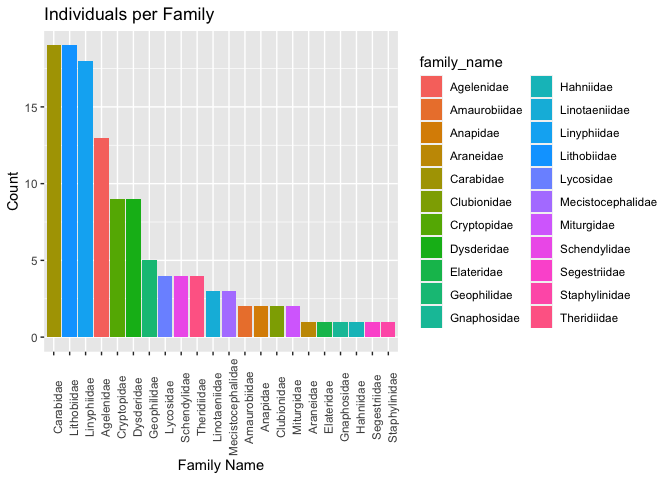
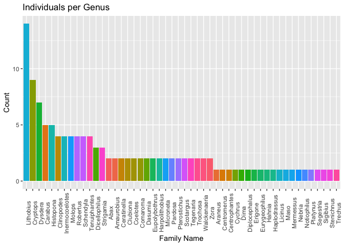

Compiled_data_inspect
================
2022-05-05

I also read in the “DS-KROK4BDJ.txt” file, which is a tsv downloaded
from our paper of choice and (I believe) contains all the data we will
need to work with, including sample IDs, geographic information, and
sequences.

After reading in the file, I inspect the column dimensions

``` r
dim(bdj)
```

    ## [1] 124  80

``` r
kable(column_names)
```

| x                          |
|:---------------------------|
| processid                  |
| sampleid                   |
| recordID                   |
| catalognum                 |
| fieldnum                   |
| institution_storing        |
| collection_code            |
| bin_uri                    |
| phylum_taxID               |
| phylum_name                |
| class_taxID                |
| class_name                 |
| order_taxID                |
| order_name                 |
| family_taxID               |
| family_name                |
| subfamily_taxID            |
| subfamily_name             |
| genus_taxID                |
| genus_name                 |
| species_taxID              |
| species_name               |
| subspecies_taxID           |
| subspecies_name            |
| identification_provided_by |
| identification_method      |
| identification_reference   |
| tax_note                   |
| voucher_status             |
| tissue_type                |
| collection_event_id        |
| collectors                 |
| collectiondate_start       |
| collectiondate_end         |
| collectiontime             |
| collection_note            |
| site_code                  |
| sampling_protocol          |
| lifestage                  |
| sex                        |
| reproduction               |
| habitat                    |
| associated_specimens       |
| associated_taxa            |
| extrainfo                  |
| notes                      |
| lat                        |
| lon                        |
| coord_source               |
| coord_accuracy             |
| elev                       |
| depth                      |
| elev_accuracy              |
| depth_accuracy             |
| country                    |
| province_state             |
| region                     |
| sector                     |
| exactsite                  |
| image_ids                  |
| image_urls                 |
| media_descriptors          |
| captions                   |
| copyright_holders          |
| copyright_years            |
| copyright_licenses         |
| copyright_institutions     |
| photographers              |
| sequenceID                 |
| markercode                 |
| genbank_accession          |
| nucleotides                |
| trace_ids                  |
| trace_names                |
| trace_links                |
| run_dates                  |
| sequencing_centers         |
| directions                 |
| seq_primers                |
| marker_codes               |

Let’s look at the first 5 rows in this file. It’s a large chunk, but
very interesting. Scroll side to side to see the whole chunk.

``` r
kable(bdj[1:5])
```

| processid  | sampleid | recordID | catalognum | fieldnum |
|:-----------|:---------|---------:|:-----------|:---------|
| KROK004-19 | CLPT-004 | 10924772 | CLPT-004   | NA       |
| KROK005-19 | CLPT-005 | 10924773 | CLPT-005   | NA       |
| KROK008-19 | CLPT-015 | 10924776 | CLPT-015   | NA       |
| KROK010-19 | CLPT-017 | 10924778 | CLPT-017   | NA       |
| KROK011-19 | CLPT-018 | 10924779 | CLPT-018   | NA       |
| KROK012-19 | CLPT-019 | 10924780 | CLPT-019   | NA       |
| KROK015-19 | CLPT-023 | 10924783 | CLPT-023   | NA       |
| KROK018-19 | CLPT-026 | 10924786 | CLPT-026   | NA       |
| KROK019-19 | CLPT-027 | 10924787 | CLPT-027   | NA       |
| KROK022-19 | CLPT-030 | 10924790 | CLPT-030   | NA       |
| KROK025-19 | GPHM-001 | 10924793 | GPHM-001   | NA       |
| KROK031-19 | GPHM-049 | 10924799 | GPHM-049   | NA       |
| KROK032-19 | GPHM-053 | 10924800 | GPHM-053   | NA       |
| KROK035-19 | LTHB-003 | 10924803 | LTHB-003   | NA       |
| KROK037-19 | LTHB-010 | 10924805 | LTHB-010   | NA       |
| KROK038-19 | LTHB-013 | 10924806 | LTHB-013   | NA       |
| KROK039-19 | LTHB-020 | 10924807 | LTHB-020   | NA       |
| KROK046-19 | LTHB-46  | 10924814 | LTHB-46    | NA       |
| KROK050-19 | SCLP-011 | 10924818 | SCLP-011   | NA       |
| KROK054-19 | SPDR-013 | 10924822 | SPDR-013   | NA       |
| KROK055-19 | SPDR-021 | 10924823 | SPDR-021   | NA       |
| KROK056-19 | SPDR-025 | 10924824 | SPDR-025   | NA       |
| KROK057-19 | SPDR-029 | 10924825 | SPDR-029   | NA       |
| KROK059-19 | SPDR-043 | 10924827 | SPDR-043   | NA       |
| KROK060-19 | SPDR-049 | 10924828 | SPDR-049   | NA       |
| KROK064-19 | SPDR-057 | 10924832 | SPDR-057   | NA       |
| KROK065-19 | SPDR-062 | 10924833 | SPDR-062   | NA       |
| KROK066-19 | SPDR-064 | 10924834 | SPDR-064   | NA       |
| KROK067-19 | SPDR-072 | 10924835 | SPDR-072   | NA       |
| KROK069-19 | SPDR-076 | 10924837 | SPDR-076   | NA       |
| KROK072-19 | SPDR-088 | 10924840 | SPDR-088   | NA       |
| KROK074-19 | SPDR-092 | 10924842 | SPDR-092   | NA       |
| KROK084-19 | SPDR-121 | 10924852 | SPDR-121   | NA       |
| KROK085-19 | SPDR-126 | 10924853 | SPDR-126   | NA       |
| KROK087-19 | SPDR-133 | 10924855 | SPDR-133   | NA       |
| KROK088-19 | SPDR-136 | 10924856 | SPDR-136   | NA       |
| KROK089-19 | SPDR-139 | 10924857 | SPDR-139   | NA       |
| KROK090-20 | GPHM-002 | 12394088 | GPHM-002   | NA       |
| KROK091-20 | GPHM-004 | 12394089 | GPHM-004   | NA       |
| KROK092-20 | GPHM-013 | 12394090 | GPHM-013   | NA       |
| KROK096-20 | GPHM-044 | 12394094 | GPHM-044   | NA       |
| KROK100-20 | GPHM68   | 12394098 | GPHM68     | NA       |
| KROK102-20 | GPHM71   | 12394100 | GPHM71     | NA       |
| KROK103-20 | LTHB-007 | 12394101 | LTHB-007   | NA       |
| KROK104-20 | LTHB-016 | 12394102 | LTHB-016   | NA       |
| KROK105-20 | LTHB-018 | 12394103 | LTHB-018   | NA       |
| KROK108-20 | LTHB53   | 12394106 | LTHB53     | NA       |
| KROK111-20 | LTHB57   | 12394109 | LTHB57     | NA       |
| KROK120-20 | SCLP-010 | 12394118 | SCLP-010   | NA       |
| KROK122-20 | SCLP-013 | 12394120 | SCLP-013   | NA       |
| KROK123-20 | SCLP-014 | 12394121 | SCLP-014   | NA       |
| KROK127-20 | SPDR-005 | 12394125 | SPDR-005   | NA       |
| KROK128-20 | SPDR-009 | 12394126 | SPDR-009   | NA       |
| KROK129-20 | SPDR-010 | 12394127 | SPDR-010   | NA       |
| KROK135-20 | SPDR-045 | 12394133 | SPDR-045   | NA       |
| KROK136-20 | SPDR-048 | 12394134 | SPDR-048   | NA       |
| KROK139-20 | SPDR-056 | 12394137 | SPDR-056   | NA       |
| KROK144-20 | SPDR-084 | 12394142 | SPDR-084   | NA       |
| KROK145-20 | SPDR-102 | 12394143 | SPDR-102   | NA       |
| KROK149-20 | SPDR-123 | 12394147 | SPDR-123   | NA       |
| KROK150-20 | SPDR-130 | 12394148 | SPDR-130   | NA       |
| KROK151-20 | SPDR-135 | 12394149 | SPDR-135   | NA       |
| KROK153-20 | SPDR-141 | 12394151 | SPDR-141   | NA       |
| KROK154-20 | SPDR-142 | 12394152 | SPDR-142   | NA       |
| KROK002-19 | CLPT-002 | 10924770 | CLPT-002   | NA       |
| KROK003-19 | CLPT-003 | 10924771 | CLPT-003   | NA       |
| KROK006-19 | CLPT-007 | 10924774 | CLPT-007   | NA       |
| KROK007-19 | CLPT-009 | 10924775 | CLPT-009   | NA       |
| KROK013-19 | CLPT-020 | 10924781 | CLPT-020   | NA       |
| KROK014-19 | CLPT-021 | 10924782 | CLPT-021   | NA       |
| KROK016-19 | CLPT-024 | 10924784 | CLPT-024   | NA       |
| KROK017-19 | CLPT-025 | 10924785 | CLPT-025   | NA       |
| KROK020-19 | CLPT-028 | 10924788 | CLPT-028   | NA       |
| KROK021-19 | CLPT-029 | 10924789 | CLPT-029   | NA       |
| KROK023-19 | CLPT-031 | 10924791 | CLPT-031   | NA       |
| KROK026-19 | GPHM-003 | 10924794 | GPHM-003   | NA       |
| KROK027-19 | GPHM-008 | 10924795 | GPHM-008   | NA       |
| KROK029-19 | GPHM-029 | 10924797 | GPHM-029   | NA       |
| KROK030-19 | GPHM-035 | 10924798 | GPHM-035   | NA       |
| KROK036-19 | LTHB-006 | 10924804 | LTHB-006   | NA       |
| KROK041-19 | LTHB-032 | 10924809 | LTHB-032   | NA       |
| KROK042-19 | LTHB-033 | 10924810 | LTHB-033   | NA       |
| KROK043-19 | LTHB-035 | 10924811 | LTHB-035   | NA       |
| KROK044-19 | LTHB-040 | 10924812 | LTHB-040   | NA       |
| KROK047-19 | LTHB-48  | 10924815 | LTHB-48    | NA       |
| KROK048-19 | LTHB-49  | 10924816 | LTHB-49    | NA       |
| KROK052-19 | SPDR-001 | 10924820 | SPDR-001   | NA       |
| KROK053-19 | SPDR-007 | 10924821 | SPDR-007   | NA       |
| KROK058-19 | SPDR-037 | 10924826 | SPDR-037   | NA       |
| KROK061-19 | SPDR-051 | 10924829 | SPDR-051   | NA       |
| KROK068-19 | SPDR-073 | 10924836 | SPDR-073   | NA       |
| KROK070-19 | SPDR-085 | 10924838 | SPDR-085   | NA       |
| KROK073-19 | SPDR-091 | 10924841 | SPDR-091   | NA       |
| KROK075-19 | SPDR-093 | 10924843 | SPDR-093   | NA       |
| KROK077-19 | SPDR-099 | 10924845 | SPDR-099   | NA       |
| KROK078-19 | SPDR-104 | 10924846 | SPDR-104   | NA       |
| KROK079-19 | SPDR-107 | 10924847 | SPDR-107   | NA       |
| KROK080-19 | SPDR-110 | 10924848 | SPDR-110   | NA       |
| KROK082-19 | SPDR-115 | 10924850 | SPDR-115   | NA       |
| KROK083-19 | SPDR-120 | 10924851 | SPDR-120   | NA       |
| KROK086-19 | SPDR-129 | 10924854 | SPDR-129   | NA       |
| KROK095-20 | GPHM-032 | 12394093 | GPHM-032   | NA       |
| KROK098-20 | GPHM64   | 12394096 | GPHM64     | NA       |
| KROK106-20 | LTHB-034 | 12394104 | LTHB-034   | NA       |
| KROK109-20 | LTHB54   | 12394107 | LTHB54     | NA       |
| KROK119-20 | SCLP-009 | 12394117 | SCLP-009   | NA       |
| KROK121-20 | SCLP-012 | 12394119 | SCLP-012   | NA       |
| KROK124-20 | SCLP-016 | 12394122 | SCLP-016   | NA       |
| KROK125-20 | SCLP18   | 12394123 | SCLP18     | NA       |
| KROK126-20 | SCLP19   | 12394124 | SCLP19     | NA       |
| KROK130-20 | SPDR-016 | 12394128 | SPDR-016   | NA       |
| KROK131-20 | SPDR-019 | 12394129 | SPDR-019   | NA       |
| KROK132-20 | SPDR-027 | 12394130 | SPDR-027   | NA       |
| KROK133-20 | SPDR-031 | 12394131 | SPDR-031   | NA       |
| KROK134-20 | SPDR-034 | 12394132 | SPDR-034   | NA       |
| KROK137-20 | SPDR-050 | 12394135 | SPDR-050   | NA       |
| KROK138-20 | SPDR-055 | 12394136 | SPDR-055   | NA       |
| KROK140-20 | SPDR-058 | 12394138 | SPDR-058   | NA       |
| KROK141-20 | SPDR-059 | 12394139 | SPDR-059   | NA       |
| KROK143-20 | SPDR-082 | 12394141 | SPDR-082   | NA       |
| KROK146-20 | SPDR-105 | 12394144 | SPDR-105   | NA       |
| KROK147-20 | SPDR-111 | 12394145 | SPDR-111   | NA       |
| KROK148-20 | SPDR-119 | 12394146 | SPDR-119   | NA       |
| KROK152-20 | SPDR-137 | 12394150 | SPDR-137   | NA       |

From this point, we can pick out columns that we want to work with. For
practice, I will select the phylum-subspecies taxID and name columns (14
columns total) and convert them to factor. After this (hidden) code
chunk, the “bdj” object (our data) columns with these names will be
converted from “numeric” or “character” to “factor”. Since they are now
factors, we can run other analyses on them and visualize how many of
each, etc.

Next check out the various family names in this file.

``` r
unique(bdj$family_name) %>% as.matrix(family_name) -> family_name_view
kable(family_name_view)
```

|                   |
|:------------------|
| Carabidae         |
| Geophilidae       |
| Linotaeniidae     |
| Mecistocephalidae |
| Lithobiidae       |
| Cryptopidae       |
| Agelenidae        |
| Anapidae          |
| Clubionidae       |
| Dysderidae        |
| Gnaphosidae       |
| Theridiidae       |
| Linyphiidae       |
| Lycosidae         |
| Miturgidae        |
| Segestriidae      |
| Schendylidae      |
| Araneidae         |
| Staphylinidae     |
| Elateridae        |
| Amaurobiidae      |
| Hahniidae         |

I’d like to visualize how many samples per family we have. In other
words, how many “Therididae”? How many “Anapidae”?

I’ll use ggplot to do this.

``` r
ggplot(bdj, aes(x=reorder(family_name, family_name, function(x)-length(x)),fill=family_name)) +
  geom_bar() +
  labs(title="Individuals per Family", 
         x="Family Name", y = "Count") +
  theme(axis.text.x = element_text(angle = 90))
```

<!-- --> Do
the same thing for genus:

``` r
ggplot(bdj, aes(x=reorder(genus_name, genus_name, function(x)-length(x)),fill=genus_name)) +
  geom_bar() +
  labs(title="Individuals per Genus", 
         x="Family Name", y = "Count") +
  theme(axis.text.x = element_text(angle = 90)) +
  theme(legend.position="none") 
```

<!-- -->
Next read the “bdj’ object into a new object (called”phylo”). We can
work with the phylo object moving forward.

``` r
phylo <- bdj
```

Now we prepare to retrieve the BOLD sequence data.

``` r
phylo_bold <- bold_seq(taxon = NULL, ids = phylo$processid, bin = phylo$bin_uri, container = NULL, institutions = NULL, 
                  researchers = NULL, geo = NULL, marker = "COI-5P", response = FALSE)
```

Here we matched the bin_uri information to the BOLD database, retrieved
the sequence. And next we checked manually the first few entries against
the NCBI database to double check the correct species was identified. We
used process_id and bin_uri to define the gene and the species.

Before we move on, however, we need to check whether there are 124
unique “bin_uri”s in our file.

``` r
bdj%>% filter(!duplicated(.[["bin_uri"]])) -> unique_binuri
```

There are only 48 unique bin_uri entries.

Now we check whether there are 124 unique process ids.

``` r
bdj%>% filter(!duplicated(.[["processid"]])) -> unique_processid
```

There are, in fact, 124 unique processids. This is correct and to be
expected.

We also want to know whether there are any NAs in the bin_uri column of
phylo.

``` r
sum(is.na(phylo$bin_uri))
```

    ## [1] 9

There are 9 NAs in the bin_uri column. This is important to know moving
forward because we can expect to return 115 sequences instead of 124.

Next we make the BOLD output object (phylo_bold) into a dataframe.

Credit for below code which we used to transform phylo_bold into a
dataframe:
<https://stackoverflow.com/questions/26973029/split-one-row-after-every-3rd-column-and-transport-those-3-columns-as-a-new-row>

``` r
phylo_bold_df<- as.data.frame(matrix(unlist(phylo_bold, use.names = FALSE), ncol = 4, byrow= TRUE))
```

We

``` r
phylo_bold_trim <- as.tibble(phylo_bold_df) %>%select(1,2,4)
```

    ## Warning: `as.tibble()` was deprecated in tibble 2.0.0.
    ## Please use `as_tibble()` instead.
    ## The signature and semantics have changed, see `?as_tibble`.
    ## This warning is displayed once every 8 hours.
    ## Call `lifecycle::last_lifecycle_warnings()` to see where this warning was generated.

``` r
colnames(phylo_bold_trim) = c("ID", "name", "sequence")
```

Now “phylo_bold_trim” is trimmed of unnecessary columns, in proper
format. The final goal for this object is to read into a fasta file.
Before we do that, we need to combine the “ID” and “name” columns into
one column. After doing this, we check to see what class our object is.
We need it to be one dataframe.

``` r
phylo_bold_combo<- phylo_bold_trim %>% unite("name", 1:2, na.rm = TRUE, remove = TRUE)
class(phylo_bold_combo)
```

    ## [1] "tbl_df"     "tbl"        "data.frame"

Since we see that this is not one dataframe, but a “tbl_df”, “tbl”, and
“data.frame”, we need to change it into a dataframe. After doing this,
we make it into a fasta file.

``` r
bold_combo_df <- as.data.frame(phylo_bold_combo)

phylo_bold.fasta = dataframe2fas(bold_combo_df, file = "phylo_bold.fasta")
```

We now use the msa package to align the sequences in our fasta file.

``` r
mySequencesphylo <- readDNAStringSet("phylo_bold.fasta")
phylo_alignment <- msa(mySequencesphylo)
```

    ## use default substitution matrix

``` r
phylo_alignment
```

    ## CLUSTAL 2.1  
    ## 
    ## Call:
    ##    msa(mySequencesphylo)
    ## 
    ## MsaDNAMultipleAlignment with 115 rows and 717 columns
    ##       aln                                                  names
    ##   [1] -------------------------...------------------------ KROK002-19_Abax p...
    ##   [2] ------------------AAGATAT...------------------------ KROK008-19_Abax o...
    ##   [3] -------------------------...------------------------ KROK004-19_Licinu...
    ##   [4] --------------------GATAT...TG---------------------- KROK012-19_Molops...
    ##   [5] -------------------------...------------------------ KROK018-19_Molops...
    ##   [6] ------------------AAGATAT...TTGT-------------------- KROK017-19_Molops...
    ##   [7] -------------------------...------------------------ KROK015-19_Molops...
    ##   [8] -------------------------...------------------------ KROK005-19_Pteros...
    ##   [9] -------------------------...------------------------ KROK016-19_Pteros... 
    ##   ... ...
    ## [108] -------------------------...------------------------ KROK032-19_Dicell...
    ## [109] -------------------------...------------------------ KROK029-19_Schend...
    ## [110] -------------------------...------------------------ KROK095-20_Schend...
    ## [111] -------------------------...------------------------ KROK092-20_Schend...
    ## [112] -------------------------...------------------------ KROK102-20_Schend...
    ## [113] -------------------------...------------------------ KROK030-19_Striga...
    ## [114] -------------------------...------------------------ KROK096-20_Striga...
    ## [115] -------------------------...TTGGCC------------------ KROK031-19_Striga...
    ##   Con -------------------------...------------------------ Consensus

\`\`\`
